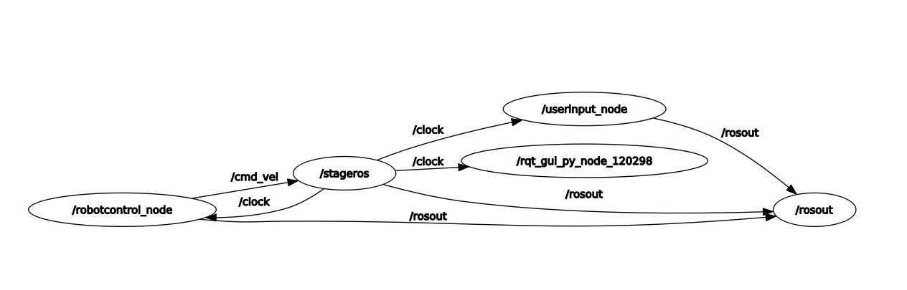

# RT1 Assignment 2
##INTRODUCTION

The second assignment is very similar to the first assignment. The only difference is that for the second assignment, ROS is being used for controlling the robot. The robot is endowed with laser scanners. The task at hand is to have 2 nodes, one to control the robot and the other to interact with the user. The way the user can interact is by increasing or decreasing the speed of the robot and also by resetting it to its original position.

How is the robot being controlled?
To control the robot, I had to do the following:

1. Publish a velocity on the cmd_vel topic
2. Used the /base_scan topic to get information about the surrounding environment, in particular the information about the distance of the obstacles is in ranges vector.

The entire assignment has been done in cpp.

### INITIAL SETUP BEFORE STARTING TO CODE

The steps I followed in order to start with the assignment is to create my own workspace. I called it RT1_Assignment2. Then I created the source folder inside the RT1_Assignment2. When that was done I performed a catkin_make.
The code using the terminal can be followed like this:
```bash
mkdir RT1_Assignment2
cd RT1_Assignment2
mkdir src
catkin_make
```
**Remember to source your workspace. You can do it either by using the .bashrc file or just source it within the terminal itself. The best practice is to source it in the bashrc file.**

To carry out this assignment, the following package is required [second_assignment](https://github.com/CarmineD8/second_assignment.git)

To perform this assignment, I used the docker created by Prof. Carmine. So the dependencies I needed to initially start off with this assignment were already included in it. All that is needed to be done is to go to the src folder of the workspace and clone the repository containing world scene.
```bash
cd src
git clone https://github.com/CarmineD8/second_assignment.git
```
### STRUCTURE OF THE SECOND ASSIGNMENT FOLDER

Inside the world folder in the second_assignment package lies a file called my_world.world
This particular file contains the information with respect to the robot, its position, the sensor and the circuit map itself.
The world folder also contains a png with respect to the circuit.


It also contains a package.xml and a CMakeLists.txt. What are they?

The **package manifest** is an XML file called **package.xml** that must be included with any catkin-compliant package's root folder. This file defines properties about the package such as the package name, version numbers, author, maintainers, and dependencies on other catkin packages.
In my case, in the package.xml file I needed to make changes to the following:

1. ** Build Tool Dependencies**: It specifies build system tools which this package needs to build itself. My build tool dependency is catkin.
2. **Build Dependencies**: It specifies which packages are needed to build this package. The packages that I needed to build were:
    i. roscpp
    ii. rospy (not needed because we are working on roscpp)
    iii. stage_ros -> The stageros node wraps the Stage 2D multi robot simulator, via libstage. Stage simulates a world as defined in a .world file. This file tells stage everything about the world, from obstacles, to robots and other objects.
    iv. std_msgs
    v. geometry_msgs
    vi. message_generation
3. **Build Export Dependencies**: It specifies which pacckages are needed to build libraries against this package. This is the case when you transitively include their headers in public headers in this package. In my case, I used all the packages I mentioned in build dependencies.
4. **Execution Dependencies**: It specifies which packages are neede to run the code in this package. This is the casse when you depend on shared libraries in this package. In my case, I executed all the packages I mentioned in Build Dependencies.

The file **CMakeLists.txt** is the input to the CMake build system for building software packages. ANy Cmake-compliant packge contains one or more CMakeLists.txt file that describe how to build the code and where to install it. I am showing the sections where I made changes:
```bash
find_package(catkin REQUIRED COMPONENTS
  roscpp
  stage_ros
  std_msgs
  geometry_msgs
  message_generation
)
```
```bash
## Generate services in the 'srv' folder
 add_service_files(
   FILES
   robotspeed.srv
#   Service2.srv
 )
```
```bash
## Generate added messages and services with any dependencies listed here
 generate_messages(
   DEPENDENCIES
   geometry_msgs
   std_msgs
 )
```
```bash
## Declare a C++ executable
## With catkin_make all packages are built within a single CMake context
## The recommended prefix ensures that target names across packages don't collide
 add_executable(robotcontrol_node src/RobotControl.cpp)
 add_executable(userinput_node src/UserInput.cpp)
```
```bash
## Add cmake target dependencies of the executable
## same as for the library above
 add_dependencies(robotcontrol_node ${${PROJECT_NAME}_EXPORTED_TARGETS} ${catkin_EXPORTED_TARGETS})
 add_dependencies(userinput_node ${${PROJECT_NAME}_EXPORTED_TARGETS} ${catkin_EXPORTED_TARGETS})
 
 ## Specify libraries to link a library or executable target against
 target_link_libraries(robotcontrol_node
   ${catkin_LIBRARIES}
 )
  target_link_libraries(userinput_node
   ${catkin_LIBRARIES}
 )
```

Now, within the folder named second_assignment, I have created 2 more folders:

1. srv -> contains custom message

ROS uses a simplified service description language("srv") for describing ROS service types. This builds directly upon the ROS msg format to enable request/response communication between nodes. 

My custom message contains a char which will be used to make requests and a float 32 which will be used as a response. It looks as follows:
```bash
#Request is in character since the input from the user will be a character from the keyboard
char command
---
#Response would be the resultant speed that the robot drives with after increasing/decreasing the speed
float32 rspeed
```

2. src -> contains the 2 nodes (Robot Control & User Interface) in cpp format
Let us delve a bit into my nodes.

In this assignment we are using a Server-Client since it tends to be more request response. In Server-Client, a client makes an explicit request for some specific data. Publisher-Subscriber tends to be for different purposes where you subscribe to something, process it and publish it. Usually at a fairly fixed rate. You can subscribe to multiple things and publish multiple things. Multiple other nodes can subscribe to the same topic. You can even have multiple nodes publishing the same topic. 

I. UserInput

The UserInput is a request node as the user will request to make modifications with respect to the speed of the robot. The user can also reset the position of the robot. Steps to ensure while(ros::ok()):

1. We first need to make sure that the service is ready before calling it.
2. When the user presses the button, there should be a request sent to either increase, decrease or reset the position of the robot.
3. After requesting, the custom service we created is called in the case where the speed needs to increase or decrease, whereas when the reset is requested an Empty Service is called. For an Empty service, no actual data is exchanged between the service and the client.

II. RobotControl

In RobotControl node, which is a respond node, I created 2 functions. The 1st one is a function that responds to the User's Input and the other one is a callback function that processes information from the laser. A hint was given to divide the ranges vector into subsections, and take the minimum value of each subsection. There are a total of 721 elements, which I divided into 3 sections. This node publishs the /cmd_vel and subscribes to the Laserscanning callback function. Finally it advertises a Service to manipulate the speed of the robot.

## Simulation

If all the steps have been followed until now, then the last remaining thing to do is to perform the simulation. The following commands need to be inserted:
```bash
# After writing all the nodes, go to the beginning of the workspace
cd ./path/to/beginning/of/second_assignment/folder
# As a habit I use killall -9 roscore and then killall -9 rosmaster so I can start fresh
killall -9 roscore
killall -9 rosmaster
catkin_make
roscore &
rospack profile # Just to see packages
rosrun stage_ros stageros $(rospack find second_assignment)/world/my_world.world
```
In 2 separate Terminals run the UserInput node and the RobotControl node:
```bash
rosrun second_assignment userinput_node
```
```bash
rosrun second_assignment robotcontrol_node
```
It yields the following result which is displayed in the form of GIFs showing that the user input works and the laser scanner working perfectly as well!!!

**User Input**


**Laser Scanner**


While all nodes are running, one can have a look at the way the nodes and topics communicate with each other by using the following command on a separate terminal:
```bash
rosrun rqt_graph rqt_graph
```
It will show the following graphs:
**Nodes Only**


**Nodes and Topics**


## PseudaCode

### UserInput.cpp
```python
Include all necessary files

Define a service client to change the speed of the robot and also define the srv itself

MAIN FUNCTION()

Initialize the userinput_node 
Define a node handle 

Define a Service CLient

while(ros::(ok))
Get Input from the User
Use a switch case to define various commands the Robot would have to perform if the User requests it.
Example:
case ('w'):
     // This will request the robot to move faster.
     robot_speed.waitForExistence();
     robspeed.request.command = 'w';
     robot_speed.call(robspeed);
     std::cout<<"You have chosen to increase the speed. Increasing speed!!\n";
break;
Do the same for the rest of the commands!
After that the ros rate will sleep for the amount of time needed to complete the 0.1 seconds. If the code takes longer, the sleep will be shorter

ROS Spin to create a loop for the user to input a command continuously.
```

### RobotControl.cpp
```python
Include all necessary header files

Initialize minimum and maximum speeds for the robot to travel by. Also initialize a speed that will change the resultant speed based on the input.

Define thresholds so the robot does not hit the walls.
Define the range vector with 720 elements.

Set Publisher, Service Server and Empty Service globally

Initialize velocity of the robot to 0.0

Write a function to respond to the user's input. It will be a boolean function.
Example: 
bool speed_response(second_assignment::robotspeed:: Request& req, second_assignment::robotspeed:: Response& res )

Write a switch case for every command the user can request.
Example:
case('w'):
    manip_sp += 0.2;
    if(manip_sp>max_sp){
    std::cout<<"You have already reached the max speed. I would advice you to decrease the speed around corners as the robot might crash with the boundary.\n";
    manip_sp=max_sp;
    }
break;

For Resetting the robot use the following case:
case('r'):
     ros::service::call("/reset_positions", reset);
break;     

Return response to the request

After that write a Laser Callback function as follows:
void laser_callback(const sensor_msgs::LaserScan::ConstPtr& scanning)

Inside function define float values for the front, left and right of the robot. Set the range to be the Threshold.

Divide the laser scanning elements into subsections like this:
// Laser Scanning of the left side of the robot
for(i = 576; i < 713; i++){
    if(laser_scanning[i] < range) {
        range = laser_scanning[i];
    }
}

Create Obstacle avoidance using if conditions like this:
// For obstacle in front of the robot
if (front < 1.5){
    // In case there is an obstacle on the left
    if(left < right) {
       vel.linear.x = 0.2;
       vel.angular.z = -1.0;
    }
    
    // In case there is an obstacle on the right
    else if(right < left) {
       vel.linear.x = 0.2;
       vel.angular.z = 1.0;
    }
}

Otherwise

Drive Straight

Publish the /cmd_vel topic.

In the MAIN FUNCTION

Initialize the node and nodehandle

Publish, subscribe and AdvertiseService
pub = n.advertise<geometry_msgs::Twist>("/cmd_vel",1);
ros::Subscriber sub=n.subscribe("/base_scan",1, laser_callback);
ch_in_sp = n.advertiseService("manipulate_speed",speed_response);


```
